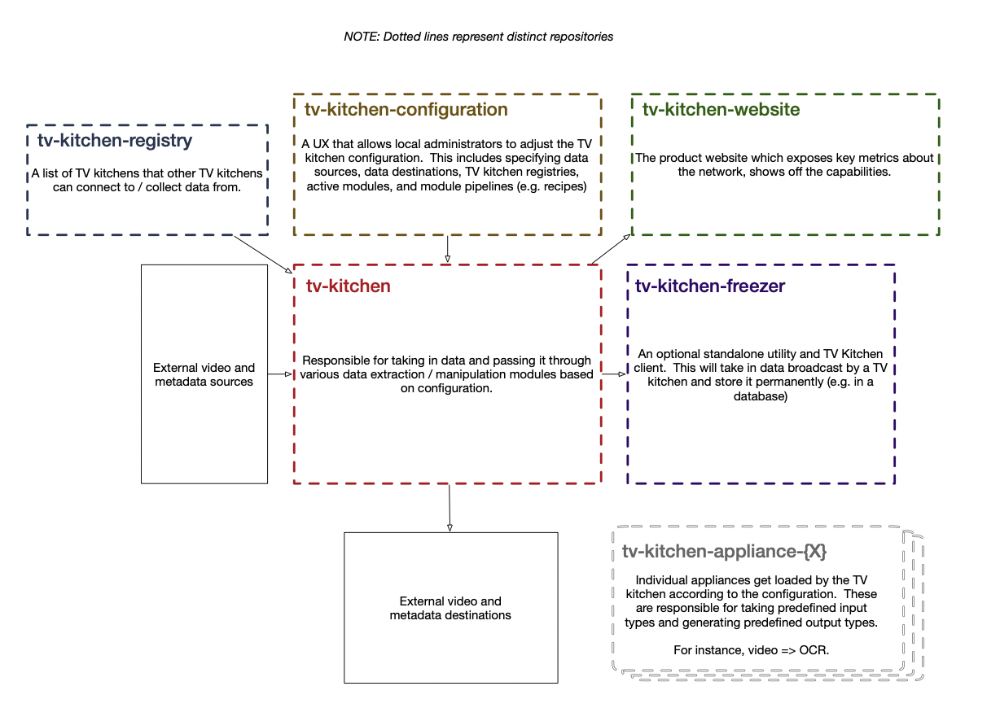
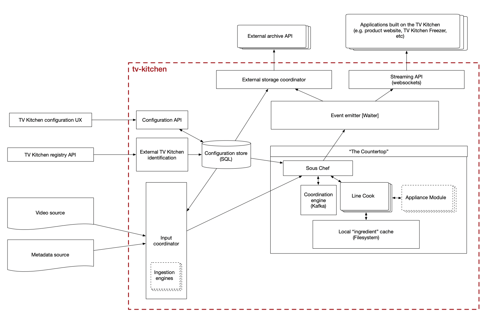

# TV Kitchen Architecture

## Ecosystem

The TV Kitchen ecosystem is made up of a few distinct pieces which are not all contained within this repository.

1. `tv-kitchen-registry` is a directory of deployed TV Kitchens. This allows TV kitchens to network with one another and share events / data.

2. `tv-kitchen-configuration` is a UX that allows for the tool configuration of a single TV Kitchen instance.

3. [`tv-kitchen-website`](https://github.com/tvkitchen/tv-kitchen-website) is the product / documentation page that is rendered at [tv.kitchen](https://tv.kitchen).

4. [`tv-kitchen`](https://github.com/tvkitchen/tv-kitchen) is the core TV Kitchen application responsible for converting video into streams of structured data. It has no memory, but essentially represents a real time ETL pipeline.

5. `tv-kitchen-freezer` is a client of the TV Kitchen that converts data streams into a data archive and a REST API. This is an optional utility which allows for the development of applications with a memory of what happened in the past.

6. `tv-kitchen-appliance-{X}` are ETL packages that take specific types of data and generate novel / decorated data. For example: caption extraction from video, named entity extraction from captions, snapshots from video, text from snapshots, etc.

## TV Kitchen Core (tv-kitchen)

* `Configuration API` exposes the user-configurable settings of a TV Kitchen so that an external UX can be created to drive that configuration.

* `External TV Kitchen Identification` is an interface that knows how to talk to a `tv-kitchen-registry` to get a list of other TV Kitchens that might generate data.

* `Event emitter` is responsible for taking new events and broadcasting them appropriately.

* `External storage coordinator` will collate data generated by the TV Kitchen and send it to whatever external storage source is configured.

* `Streaming API` is the primary interface that external applications will use to access TV Kitchen data.  It will use websockets to provide events as they are generated by the system.

### Input Coordinator

The `Input Coordinator` is responsible for interacting with pre-identified media sources and converting them to a standardized format, ready for real time processing.

`Ingestion engines` know how to do the input coordination work for a specific type of input.

### The Countertop

The `Countertop` is where data is processed according to predefined instructions (`recipes`). The `Sous Chef` keeps track of what steps have been taken and what available data exists for a given stream. It issues instructions to `Line Cooks` which are responsible for using `Appliance Modules` to perform a given task.

The Line Cooks send updates / new data back to the Sous Chef. The Sous Chef then:

1. Shares that update with the Event Emitter.
2. Passes further instructions to whatever Line Cook next steps are dictated by the recipe.

Temporary byproducts (`ingredients`) are stored in the local filesystem, and cleaned up after the recipe is over.

Kafka is used as the coordination engine for recipes, with the Sous Chef producing instructions via Kafka queues, and the work being done by Line Cook consumers.  Line cooks will in turn produce completion messages which are consumed by the Sous Chef.
